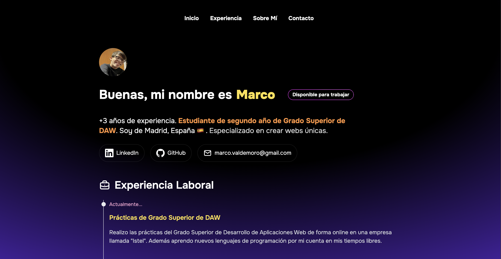

# Mi portfolio como developer

Realizado con el framework de Astro y Tailwind CSS



Mi estructura de carpetas:

```sh
Proyecto-Web-Standard/
├── src
│   ├── assets/
│   │   ├── marco.jpg
│   |—— components/
|       ├── AboutMe.astro
|       ├── Badge.astro
|       ├── Card.astro
|       ├── Experience.astro
|       ├── ExperienceItem.astro
|       ├── Footer.astro
|       ├── Header.astro
|       ├── SectionContainer.astro
|       ├── SocialLinks.astro
|   |―― icons
|       |―― BriefCase.astro
|       |―― GitHub.astro
|       |―― Linkedin.astro
|       |―― Mail.astro
|       |―― User.astro
|   |―― layouts
|       |―― Layout.astro
|   |―― pages
|       |―― index.astro
├── .gitignore
├── .astro.config.mjs
├── package.lock.json
├── README.md
└── tailwind.config.mjs
└── typescript.json
```

1. Instalación de las dependencias del proyecto:

```sh
npm install
```

2. Arrancar el proyecto:

```sh
npm run dev
```

Es necesario tener instalado tailwind y la fuente de `Onest`:

```sh
npx astro add tailwind
npm install @fontsource-variable/onest
```