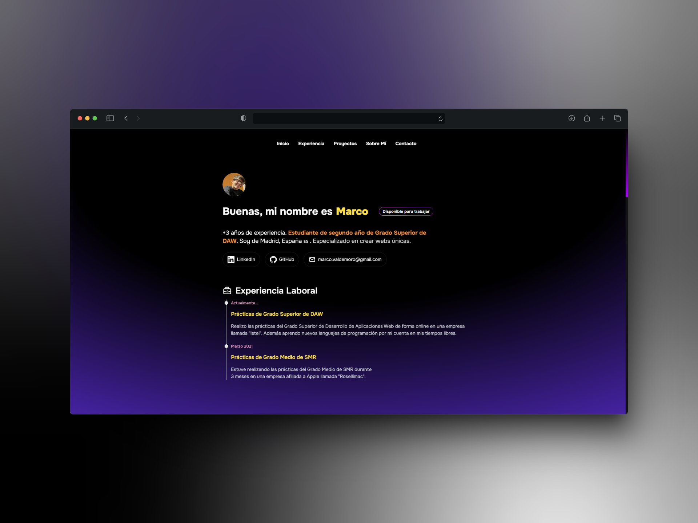

# Mi portfolio como developer

Realizado con el framework de Astro y Tailwind CSS



Mi estructura de carpetas:

```sh
/
├───assets/
│   ├───marco-2.png
│   └───marco.jpg
├───components/
│   ├───AboutMe.astro
│   ├───Badge.astro
│   ├───Card.astro
│   ├───Experience.astro
│   ├───ExperienceItem.astro
│   ├───Footer.astro
│   ├───Header.astro
│   ├───Section-Container.astro
│   └───SocialLinks.astro
├───icons/
│   ├───Briefcase.astro
│   ├───GitHub.astro
│   ├───LinkedIn.astro
│   ├───Mail.astro
│   └───User.astro
├───layouts/
│   └───Layout.astro
├───pages/
│   └───index.astro
└── package.json
```

1. Instalación de las dependencias del proyecto:

```sh
npm install
```

2. Arrancar el proyecto:

```sh
npm run dev
```

Es necesario tener instalado tailwind y la fuente de `Onest`:

```sh
npx astro add tailwind
npm install @fontsource-variable/onest
```